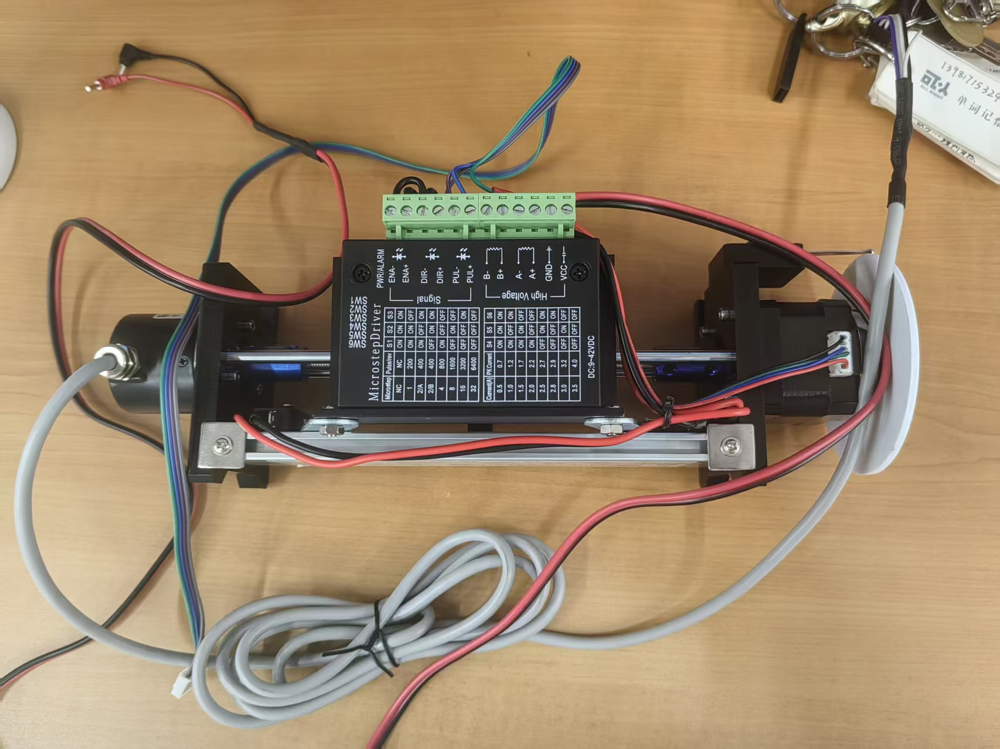
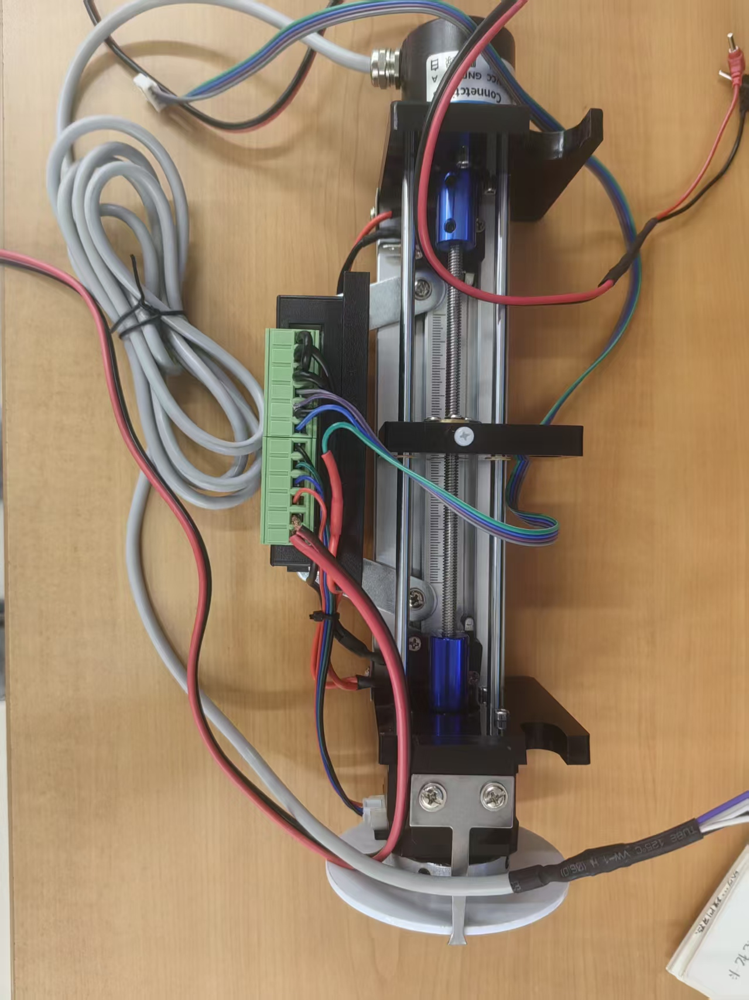
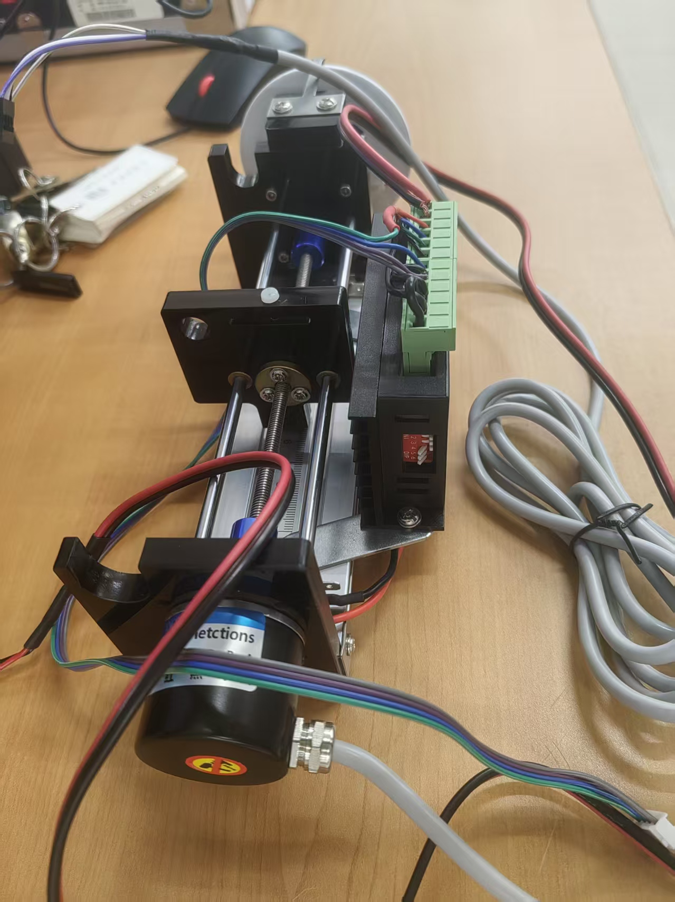
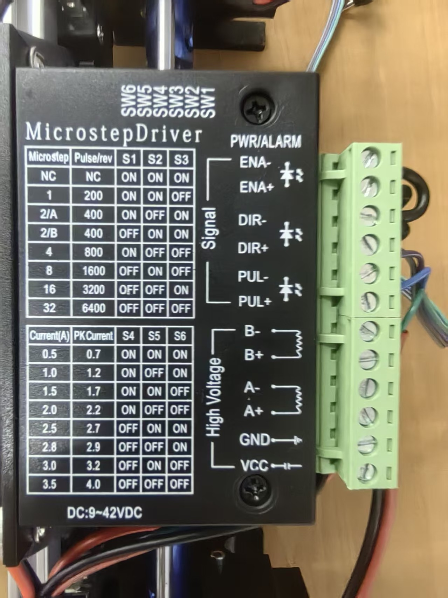
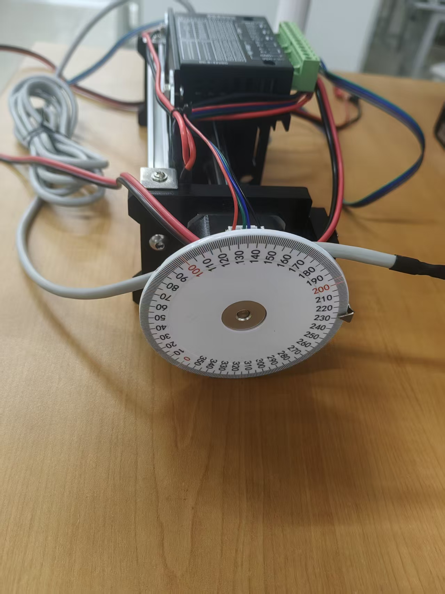
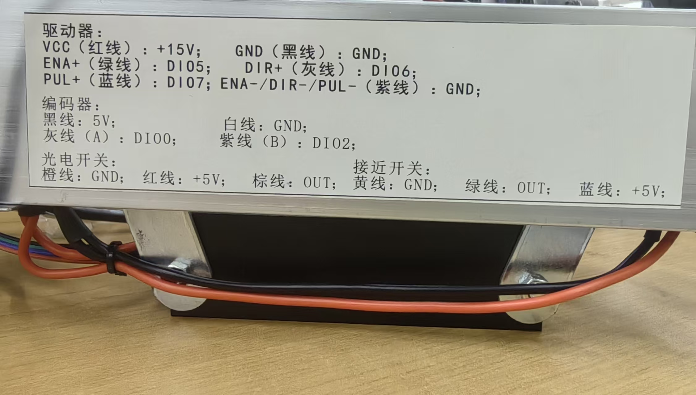

# 有限拍滑台位移环

这是一个基于 LabVIEW 与 NI myRIO 的微机控制系统实验项目，用于实现步进电机位移闭环控制，并验证有限拍控制算法在电机位移调节中的应用。项目包含 LabVIEW 工程、主 VI、实验指导书、myRIO 项目文档以及运行演示视频。



## 项目简介

本项目面向“微机控制系统实验（有限拍）”。被控对象是一套由步进电机、丝杆滑台、微步驱动器和位置反馈装置组成的位移平台。实验通过编码器实时采集电机位置，将实际位置与设定位置进行比较，再由有限拍无纹波控制算法计算控制量，输出控制信号驱动滑台运动，使系统在有限采样周期内趋近目标位置。

项目主要用于学习和验证：

- 开环控制与闭环控制系统的基本组成和工作原理
- 步进电机正反转及四相四拍驱动方式
- 编码器位移反馈采集
- 有限拍调节原理及程序实现
- LabVIEW 在 myRIO 实时控制实验中的应用

## 系统原理

实验系统由计算机、NI myRIO 数据采集卡、微步驱动器、步进电机、丝杆滑台和编码器等部分组成。编码器与电机同轴安装，用于实时检测位置；控制程序读取当前位置，并与目标位置比较得到误差；有限拍控制器根据误差计算控制量，经 myRIO 输出使能、方向和脉冲信号，最终调节滑台的位置。

控制流程可以概括为：

1. 设定目标位移和有限拍控制参数。
2. myRIO 采集编码器反馈，得到当前位移。
3. 程序计算目标位移与当前位移之间的偏差。
4. 有限拍控制算法计算控制增量和控制输出。
5. myRIO 通过数字 I/O 输出使能、方向和脉冲控制信号。
6. 前面板显示实时控制趋势曲线，并支持保存实验数据。

## 实验装置

下图展示了丝杆滑台、步进电机、微步驱动器、编码器及机械位置刻度盘。

<table>
  <tr>
    <td></td>
    <td></td>
  </tr>
  <tr>
    <td align="center">丝杆滑台俯视图</td>
    <td align="center">滑台、电机与编码器</td>
  </tr>
  <tr>
    <td></td>
    <td></td>
  </tr>
  <tr>
    <td align="center">微步驱动器及拨码配置表</td>
    <td align="center">用于观察机械位置的刻度盘</td>
  </tr>
</table>

## 硬件与软件环境

### 硬件

- NI myRIO-1900 数据采集卡
- 步进电机
- 丝杆直线滑台
- 微步驱动器
- 编码器
- 接线端子
- USB 线
- 若干导线
- 计算机

### 软件

- LabVIEW 2019 或兼容版本
- LabVIEW myRIO Toolkit
- NI myRIO 驱动环境

工程文件中的 myRIO 目标设备为 `NI-myRIO-1900-030f273a`，配置 IP 为 `172.22.11.2`。如使用不同设备，需要在 LabVIEW Project Explorer 中重新配置目标设备或修改别名。

## 接线说明

实验台铭牌给出的 myRIO 接线关系如下。接线前请断开电源，并根据实际设备再次核对电源电压与公共地。

| 模块 | 信号/线色 | myRIO 或电源连接 |
| --- | --- | --- |
| 驱动器 | VCC（红线） | `+15V` |
| 驱动器 | GND（黑线） | `GND` |
| 驱动器 | ENA+（绿线） | `DIO5` |
| 驱动器 | DIR+（灰线） | `DIO6` |
| 驱动器 | PUL+（蓝线） | `DIO7` |
| 驱动器 | ENA- / DIR- / PUL-（紫线） | `GND` |
| 编码器 | 黑线 / 白线 | `5V` / `GND` |
| 编码器 | A 相（灰线） | `DIO0` |
| 编码器 | B 相（紫线） | `DIO2` |
| 光电开关 | 红线 / 橙线 / 棕线 | `+5V` / `GND` / `OUT` |
| 接近开关 | 蓝线 / 黄线 / 绿线 | `+5V` / `GND` / `OUT` |



## 文件结构

```text
.
+-- Main.vi                                      # 主控制程序
+-- 控制电机.lvproj                              # LabVIEW 工程文件
+-- 控制电机.aliases                             # LabVIEW 目标设备别名配置
+-- 控制电机.lvlps                               # LabVIEW 项目窗口状态文件
+-- 交流电机微机测控实验台指示书（有限拍).doc      # 实验指导书
+-- 视频3.mp4                                    # 实验或运行演示视频
+-- 视频4.mp4                                    # 实验或运行演示视频
+-- assets/hardware/                             # 实验装置与接线照片
+-- documentation/
    +-- myRIO Project Documentation.html         # myRIO 模板项目说明
    +-- myRIO_Project_Diagram.gif                # myRIO 模板结构图
```

## 使用方法

1. 打开 LabVIEW。
2. 打开 `控制电机.lvproj`。
3. 在 Project Explorer 中确认 myRIO 目标设备连接正常。
4. 如设备 IP 或名称不同，更新 myRIO 目标配置。
5. 打开 myRIO 目标下的 `Main.vi`。
6. 检查数据采集卡、电机驱动、编码器和接线端子的连接。
7. 打开实验台电源。
8. 在前面板设置目标位移和有限拍控制参数。
9. 点击 LabVIEW 的 `Run` 运行程序。
10. 观察前面板实时控制趋势曲线。
11. 系统响应稳定后，可使用保存数据按钮导出实验数据。

## 实验数据处理

运行结束后，可根据保存的数据绘制位移实时控制趋势图，分析不同控制参数下系统的响应速度、稳定性和调节效果。建议记录目标位移、当前位移、误差、控制输出等关键变量，便于后续实验报告分析。

## 参考资料

- `交流电机微机测控实验台指示书（有限拍).doc`
- `documentation/myRIO Project Documentation.html`
- LabVIEW Help 与 LabVIEW myRIO Toolkit 文档
